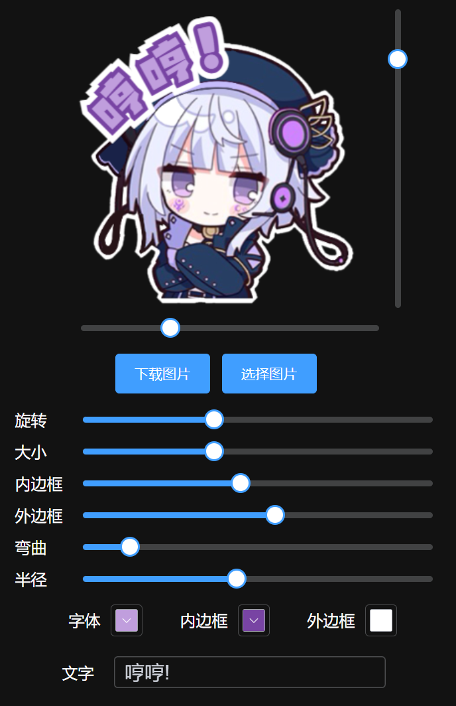

<div align="center">

**中文** | [**English**](./docs/README.md)

</div>

---

# Arcaea 和 PJSK 贴纸

这个项目允许你为 **Arcaea** 和 **PJSK**（Project Sekai）创建自定义贴纸。它包括了便捷的贴纸创建功能、改进的旋转处理和能够轻松添加自定义贴纸的功能。

## 鸣谢

该项目借鉴了以下开源代码库的实现：

- [Rosemoe(sekai-stickers)](https://github.com/Rosemoe/arcaea-stickers)
- [Ayaka(arcaea-stickers)](https://github.com/TheOriginalAyaka/sekai-stickers)

本项目中的图像和用户界面设计参考了以上两个开源项目。

## 功能

- **贴纸创建**：轻松为 Arcaea 和 PJSK 创建自定义贴纸。
- **更多自定义**：更多的自定义选项，如贴纸旋转、缩放等。
- **改进旋转**：更好地处理贴纸旋转。
- **自定义贴纸**：简便的过程将你的贴纸添加到项目中。

## 页面展示



## 运行

1. 克隆该仓库：

```bash
git clone https://github.com/Kiyuiro/stickers.git
cd stickers
```

2. 安装依赖：

```bash
npm install
```

3. 运行开发服务器：

```bash
npm run dev
```

你的应用现在应该在 http://localhost:5173 上运行。
